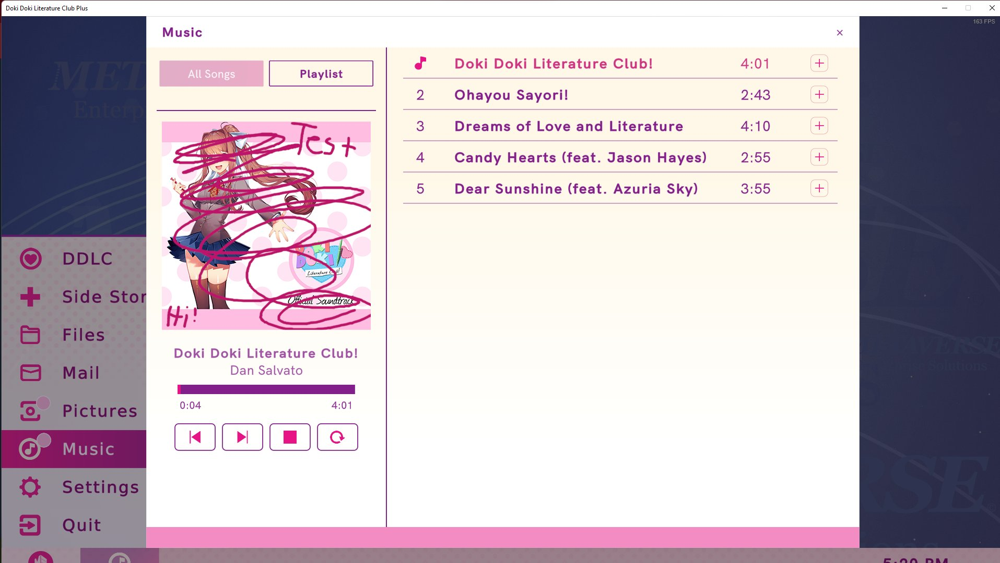

#  DDLC-Plus-Cy-Encryptor/Decryptor

## What is this?

This tool can decrypt and reencrypt DDLC+'s .cy files

## What is a .cy file?

A .cy file is a encrypted .unity3d file that contains game assets, it uses the encryption key \0x28 or decimal 40. (Atleast for DDLC+)

## How to use?

### Decrypting
1. Download the latest release from [here](https://github.com/GuglioIsStupid/DDLC-Plus-Cy-Encryptor-Decryptor/releases/latest)
2. Extract the zip file
3. Drag and drop the .cy file you want to decrypt/encrypt on decryptcy.py 
4. Wait for the process to finish
5. Open it with a program like [UABE](https://github.com/SeriousCache/UABE)
6. Enjoy!

### Encrypting
1. Download the latest release from [here](https://github.com/GuglioIsStupid/DDLC-Plus-Cy-Encryptor-Decryptor/releases/latest)
2. Extract the zip file
3. Drag and drop the .unity3d file you want to decrypt/encrypt on the encryptunity3d.py 
4. Wait for the process to finish
5. Replace the file in the StreamingAssets/AssetBundles folder
6. Enjoy!

Managed to replace the Jukebox image with a custom one, and it worked perfectly

## Requirements

- Python 3.8
- UnityPy

## Disclaimer
Moddding games MAY break your game, I am not responsible for any damage caused by this tool.

## License
These scripts are licensed under the GNU General Public License v3.0
